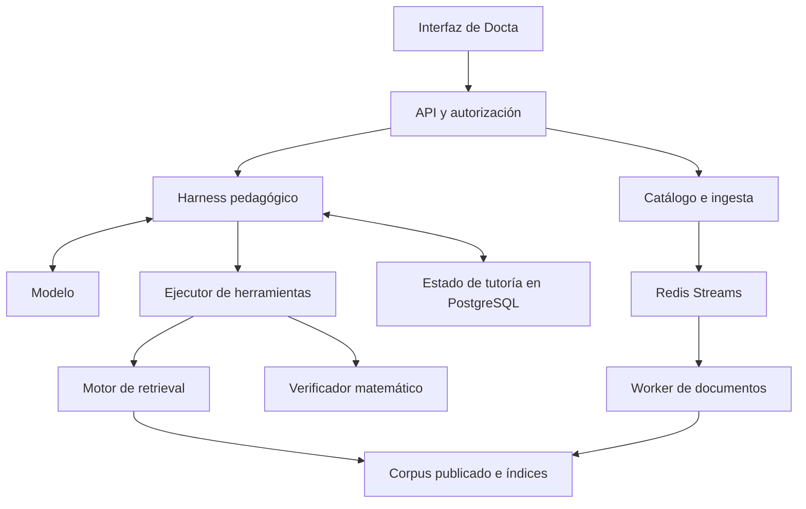
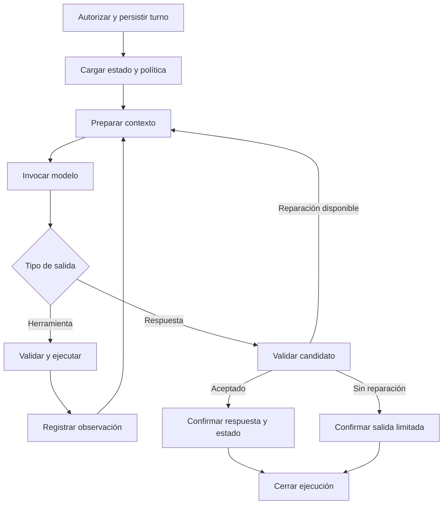
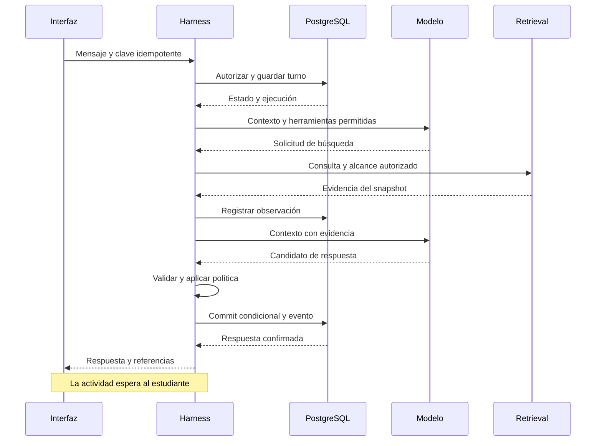
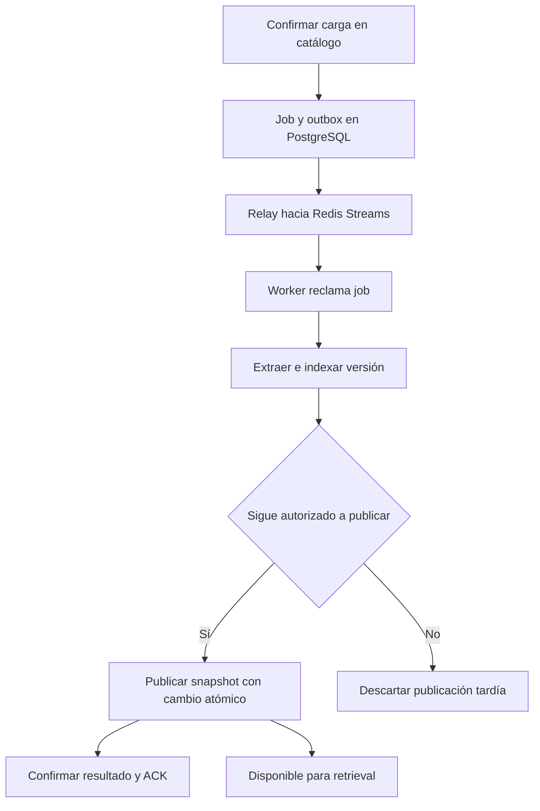

# Referencia importada — Arquitectura del harness pedagógico de Docta

> Propuesta aportada por el propietario como `DOCTA_HARNESS_ARCHITECTURE (2).md`.
> Conservada como antecedente el 2026-09-22; no aceptada automáticamente como ADR.
> El texto original continúa abajo. La [versión reconciliada](DOCTA_HARNESS_ARCHITECTURE.md)
> distingue sus recomendaciones del runtime implementado y del plan autorizado.
> Sus tablas, límites y entregas son propuestas, no pruebas de implementación.
> La revisión documental no revalida toda su bibliografía ni adopta sus recomendaciones de librerías.

## 1. Propuesta

Docta puede evolucionar hacia un tutor conversacional cuyo harness decide cómo conducir cada intervención y utiliza un motor de conocimiento del curso cuando necesita evidencia. La separación recomendada comprende tres áreas: la plataforma educativa, el conocimiento documental y la tutoría. El pipeline de ingesta alimenta el conocimiento; el harness consume sus contratos de lectura; la plataforma conserva la autoridad sobre identidad, cursos, membresías y acceso.

El siguiente paso es un desacoplamiento por módulos y contratos dentro del monolito modular. La extracción a servicios independientes puede hacerse cuando aparezcan necesidades de escalado, aislamiento de recursos o despliegue. Una llamada a herramienta del modelo puede terminar en una función Python del mismo proceso. Su condición de herramienta depende de cómo se presenta y ejecuta, y no de que utilice HTTP o MCP.

La recomendación concreta es construir un **flujo externo controlado por código con un bucle interno acotado de llamadas a herramientas**. El modelo puede solicitar búsqueda, pedir un fragmento adicional o proponer una intervención. Docta decide si la operación está permitida, qué contexto autorizado recibe, cuánto puede ejecutarse y cuándo se confirma el resultado.

El producto debe distinguir dos objetivos: producir una intervención útil en este turno y sostener una actividad de aprendizaje a lo largo de varios turnos. Formular una pregunta y esperar al estudiante puede ser una ejecución terminada correctamente. La actividad continúa, aunque ya no exista una tarea de inferencia en ejecución.

Esta propuesta toma como base declarada el walking skeleton completado hasta el incremento 4 y las decisiones de Docta sobre FastAPI, Next.js, OIDC con ZITADEL, PostgreSQL, almacenamiento compatible con S3 mediante MinIO, SSE, Redis Streams y publicación de versiones inmutables. No constituye una auditoría del repositorio. Las rutas, entidades y contratos que aparecen a continuación son propuestas de diseño; su correspondencia con clases y tablas existentes debe verificarse al implementar.

La documentación técnica se consultó con corte al 9 de septiembre de 2026. Se diferencian los hallazgos publicados de las recomendaciones propias para Docta. Los ejemplos de límites, esquemas y escenarios son configuraciones iniciales propuestas, sin mediciones de rendimiento del sistema.

## 2. Fundamento y alcance de la evidencia

La literatura respalda varias piezas del diseño, pero no establece una arquitectura universal de harness pedagógico. Los resultados de un sistema de preguntas y respuestas, un agente de programación y un tutor con estudiantes simulados responden a preguntas distintas.

| Fuente primaria | Hallazgo relevante | Aplicación y límite |
| --- | --- | --- |
| Anthropic, *Building effective agents* | Distingue workflows definidos por código y agentes con decisiones dinámicas del modelo; recomienda aumentar complejidad según resultados. | Fundamenta combinar un flujo controlado con decisiones locales del modelo. Es experiencia de ingeniería, no evidencia de aprendizaje. [^1] |
| ReAct | Estudia la alternancia entre acciones y observaciones para resolver tareas de información e interacción. | Inspira el bucle de herramientas. No exige exponer ni almacenar el razonamiento privado de los modelos actuales. [^2] |
| Self-RAG | Entrena modelos para recuperar de forma adaptativa y evaluar sus generaciones mediante tokens especiales. | Apoya investigar recuperación selectiva. Agregar una función de búsqueda a un LLM comercial no reproduce ese entrenamiento. [^3] |
| RetrievalQA | Encuentra errores en decisiones de recuperación basadas en prompting en un benchmark de preguntas abiertas. | Justifica evaluar omisiones de búsqueda y establecer reglas de evidencia. Sus modelos y tareas de 2024 no predicen las tasas de error actuales de Docta. [^4] |
| KITE | Integra recuperación, clasificación de intención, estrategias de respuesta y continuidad de sesión para tareas de algoritmos. | Es un precedente cercano. Usa métricas de RAG, revisión experta y estudiantes simulados; estos últimos no demuestran aprendizaje humano. [^5] |
| LearnLM | Formula la adaptación pedagógica como seguimiento de instrucciones específicas y evalúa conversaciones con expertos. | Respalda políticas configurables y evaluación de múltiples turnos. Preferencia experta y adquisición de conocimientos son resultados diferentes. [^6] |

La inferencia arquitectónica para Docta es que la pedagogía necesita representación explícita y evaluación, mientras que la autonomía debe corresponder a decisiones útiles. No hay evidencia en estas fuentes que obligue a implementar varios agentes para cada turno.

También conviene corregir una simplificación frecuente: que el material curricular se trate como evidencia no significa que deba ser una referencia siempre opcional. Si Docta afirma qué dice un documento o qué método exige un curso, necesita evidencia autorizada. Si ofrece una explicación matemática general, puede utilizar otro régimen de respuesta claramente definido.

## 3. Límites entre plataforma, conocimiento y tutoría

### 3.1 Responsabilidades

| Área | Responsabilidades propias | Contrato hacia otras áreas |
| --- | --- | --- |
| Plataforma educativa | Identidad, cursos, membresías, roles, configuración docente y autorización. | Contexto autorizado y políticas vigentes. |
| Catálogo e ingesta | Recepción de archivos, estados de procesamiento, extracción, fragmentación, indexación y publicación. | Versiones y snapshots de material disponibles. |
| Motor de retrieval | Recuperación, filtros, ranking, expansión de fragmentos y procedencia. | Evidencia estructurada dentro de un alcance autorizado. |
| Tutoría | Actividad, intentos, ayudas, decisiones pedagógicas y respuesta al estudiante. | Turnos y evidencias de interacción confirmados. |
| Runtime del harness | Ejecución, presupuestos, herramientas, fallos, cancelación y coordinación de persistencia. | Una ejecución observable con resultado terminal. |
| Analítica | Agregaciones para docente, evaluaciones y métricas operativas. | Lecturas de eventos y resultados persistidos. |

El harness pertenece al área de tutoría, pero parte de su runtime puede reutilizarse en otras experiencias. La autorización permanece en servicios de aplicación compartidos y se aplica también en cada herramienta.

El término «RAG engine» puede mantenerse como nombre de producto interno. Sin embargo, su contrato principal hacia el harness debería ser **retrieval de evidencia**, porque la generación de la respuesta pedagógica queda a cargo del tutor. Si también se necesita un endpoint de preguntas documentales, puede componerse como otro caso de uso sobre el mismo retriever.

### 3.2 Vista lógica



Las flechas muestran dependencias lógicas, no procesos obligatorios. El verificador matemático es una extensión posterior para operaciones acotadas. MinIO guarda los objetos y artefactos documentales; el catálogo y los índices mantienen sus referencias.

### 3.3 Contratos frente a transportes

| Integración | Uso propuesto | Costo adicional |
| --- | --- | --- |
| Puerto Python en el mismo proceso | Primer desacoplamiento entre tutoría y retrieval. | Prácticamente ningún costo de red; requiere respetar dependencias modulares. |
| API HTTP interna | Separación de despliegue, equipos o recursos. | Autenticación entre servicios, timeouts, compatibilidad y fallos de red. |
| Servidor MCP | Varios consumidores necesitan descubrir e invocar un catálogo interoperable de herramientas. | Ciclo del protocolo, autorización e integración cliente-servidor. |

MCP define herramientas con nombres y esquemas, y operaciones para descubrirlas e invocarlas. El protocolo deja margen al patrón de interacción de la aplicación. Ese contrato no resuelve por sí mismo la autorización del contenido de un curso. [^12]

Para Docta, el primer adaptador puede invocar directamente `RetrievalPort.search`. Un adaptador HTTP o MCP posterior delegaría al mismo caso de uso.

## 4. Interior del harness

### 4.1 Componentes

| Componente | Entrada y salida | Decisión principal |
| --- | --- | --- |
| `TurnService` | Mensaje autenticado → turno persistido. | Admisión, idempotencia y orden de turnos. |
| `SessionLoader` | Conversación → estado y referencias vigentes. | Qué actividad y evidencia corresponden al mensaje. |
| `PolicyResolver` | Curso y actividad → política versionada. | Modos, herramientas y condiciones de respuesta. |
| `ContextBuilder` | Política, historial y evidencia → contexto del modelo. | Qué información entra en la ventana de contexto. |
| `TutorRuntime` | Estado inicial → candidato o fallo. | Secuencia de inferencias y herramientas dentro del presupuesto. |
| `ToolExecutor` | Llamada propuesta → observación validada. | Autorización, validación, ejecución y límites. |
| `ResponseGate` | Candidato y evidencia → aceptación, reparación o salida limitada. | Condiciones necesarias para publicar. |
| `TurnCommitter` | Candidato aceptado → respuesta y eventos confirmados. | Escritura consistente y prevención de duplicados. |

Estos componentes no implican ocho modelos ni ocho llamadas. En la mayoría de los casos son funciones y servicios de aplicación. La interpretación del mensaje y la selección de la intervención pueden resolverse en la misma llamada al modelo.

### 4.2 Autoridad de cada decisión

| Decisión | Modelo | Código de Docta |
| --- | --- | --- |
| Formular una consulta de búsqueda | Propone la consulta. | Limita tamaño, número y alcance. |
| Acceder a otro curso | No concede permisos. | Verifica membresía y políticas. |
| Pedir una pista o explicar | Propone una intervención según contexto. | Restringe modos y transiciones permitidos. |
| Declarar que un alumno domina un tema | Puede producir una hipótesis. | Exige un criterio de evaluación y evidencia; no transforma la hipótesis en hecho. |
| Elegir una versión documental | Puede referirse a un recurso ya disponible. | Resuelve y fija versiones autorizadas. |
| Reintentar una herramienta | Puede solicitar otra acción. | Controla presupuesto, idempotencia y errores reintentables. |
| Publicar una respuesta | Produce un candidato. | Valida y confirma la escritura. |

El runtime puede registrar etiquetas de decisión como `needs_course_definition` o `asks_for_attempt`. Son salidas observables del sistema; no deben presentarse como una lectura fiel de los procesos internos del modelo.

### 4.3 Flujo de un turno



Los errores operativos y las cancelaciones también llevan a estados terminales. Cada transición consulta el presupuesto restante; el diagrama no autoriza un ciclo ilimitado.

Cuando existe un ejercicio seleccionado, la aplicación puede cargar su enunciado antes de la primera inferencia. Si la política exige una definición del curso, puede precargar evidencia. El modelo conserva la posibilidad de solicitar una búsqueda adicional cuando encuentre una carencia concreta.

## 5. Retrieval como herramienta

### 5.1 Interfaz visible para el modelo

La interfaz debe expresar una operación útil para el tutor y ocultar detalles de infraestructura.

```json
{
  "name": "search_course_material",
  "description": "Busca evidencia en el material autorizado del curso activo. Úsala para consultar definiciones, métodos o ejemplos del curso. Los resultados son fragmentos de referencia y pueden ser insuficientes.",
  "input_schema": {
    "type": "object",
    "properties": {
      "query": {
        "type": "string",
        "minLength": 1,
        "maxLength": 1200
      },
      "purpose": {
        "type": "string",
        "enum": ["definition", "procedure", "example", "clarification"]
      }
    },
    "required": ["query", "purpose"],
    "additionalProperties": false
  }
}
```

Este JSON ilustra un contrato neutral; el adaptador lo transforma al formato requerido por el proveedor. Los límites concretos son configurables. `purpose` expresa una preferencia de búsqueda, no un permiso.

El modelo no suministra `student_id`, roles, consultas SQL, nombres de buckets ni filtros arbitrarios. El contexto autenticado se incorpora fuera de los argumentos generados por el LLM.

### 5.2 Puerto interno

```python
from dataclasses import dataclass
from typing import Literal, Protocol

@dataclass(frozen=True)
class RetrievalScope:
    principal_id: str
    course_id: str
    snapshot_id: str
    authorization_revision: str

@dataclass(frozen=True)
class RetrievalQuery:
    query: str
    purpose: Literal["definition", "procedure", "example", "clarification"]
    max_passages: int
    max_context_tokens: int

@dataclass(frozen=True)
class EvidencePassage:
    evidence_id: str
    document_version_id: str
    document_title: str
    chunk_id: str
    page_number: int
    text: str
    content_hash: str

@dataclass(frozen=True)
class RetrievalResult:
    status: Literal["ok", "empty", "unavailable", "forbidden"]
    snapshot_id: str
    passages: tuple[EvidencePassage, ...]
    truncated: bool

class RetrievalPort(Protocol):
    async def search(
        self,
        scope: RetrievalScope,
        request: RetrievalQuery,
    ) -> RetrievalResult: ...
```

Las clases muestran la separación de responsabilidades, no una implementación lista para producción. El servicio de autorización construye el scope; el runtime fija los presupuestos. `authorization_revision` requiere una revisión real de permisos si se adopta ese mecanismo: una cadena generada sin comprobación no aporta seguridad.

El motor aplica restricciones de acceso y publicación en su consulta de datos. Una denegación no devuelve títulos, fragmentos ni conteos que revelen documentos inaccesibles. Una herramienta expuesta mediante red vuelve a verificar el contexto y la identidad del servicio llamante.

### 5.3 Resultado de la herramienta

La observación debería incluir texto suficiente, título de documento, versión, página, identificador de evidencia y advertencias de extracción relevantes. Los identificadores pueden ser opacos y locales a la ejecución; el servidor conserva la correspondencia con el catálogo.

Los scores del retriever ayudan a ordenar candidatos. No son probabilidades de verdad ni de suficiencia pedagógica. La validez estructural de una cita tampoco prueba que su contenido respalde la afirmación asociada.

Conviene distinguir explícitamente:

| Resultado | Significado | Continuación |
| --- | --- | --- |
| `ok` | Se obtuvieron fragmentos autorizados. | El tutor evalúa su pertinencia para la intervención. |
| `empty` | La búsqueda no encontró evidencia utilizable. | Reformular dentro del presupuesto, pedir aclaración o reconocer la carencia. |
| `unavailable` | Falló una dependencia o venció un timeout. | Reintento acotado o respuesta sobre la indisponibilidad. |
| `forbidden` | La operación no está autorizada. | Detener esa ruta sin ampliar el alcance. |

El caso `empty` no prueba que el concepto esté ausente de todos los documentos; puede reflejar limitaciones de búsqueda. En pgvector, las consultas con índices aproximados y filtros pueden devolver menos resultados de los esperados. Sus búsquedas iterativas permiten explorar más candidatos, con límites configurables. Esto afecta el recall, y no justifica relajar la autorización. [^15]

### 5.4 Evidencia obligatoria y recuperación opcional

| Situación | Regla propuesta |
| --- | --- |
| «Según el PDF, ¿qué significa…?» | Exigir evidencia del documento o declarar que no pudo localizarse. |
| Ejercicio seleccionado del curso | Cargar enunciado y restricciones desde su versión autorizada. |
| Continuación sobre un fragmento ya disponible | Reutilizarlo si su alcance y versión siguen siendo válidos. |
| «Gracias» o coordinación de la actividad | Resolver sin búsqueda. |
| Error algebraico independiente del material | Usar el intento y, si corresponde, el verificador; buscar si hace falta un método del curso. |
| Fuentes insuficientes o contradictorias | Buscar de nuevo dentro del límite o explicitar la dificultad. |

Esta política híbrida permite ahorro de llamadas y adaptación sin convertir la confianza del modelo en la única condición de acceso a evidencia.

### 5.5 Generación anidada

Una herramienta `ask_rag(question)` que devuelve una respuesta ya redactada por otro LLM introduce una segunda generación. El tutor debe interpretar esa respuesta, y puede perderse la relación entre afirmaciones y fragmentos originales.

Para la primera versión, es preferible `search_course_material` y, si hace falta, `get_source_fragment(evidence_id)`. La segunda herramienta solo expande referencias autorizadas del registro de evidencia. Un subproceso que sintetice documentos extensos puede incorporarse después, manteniendo procedencia y límites propios.

## 6. Pedagogía, contexto y herramientas de dominio

### 6.1 Política versionada

Un perfil pedagógico debería representar al menos modo de actividad, objetivo, estrategias permitidas, condiciones para mostrar una solución y reglas sobre fuentes. La configuración docente es una entrada con permisos y versión; no se mezcla con instrucciones encontradas dentro de un PDF.

| Modo | Conducta inicial propuesta | Condición de avance |
| --- | --- | --- |
| Consulta conceptual | Explicación directa y ajustada a la pregunta; pregunta de comprobación cuando sea útil. | Evidencia de comprensión o nueva consulta. |
| Práctica guiada | Examinar el intento, reconocer aciertos y ofrecer ayuda específica. | El estudiante realiza un paso o explica una elección. |
| Ejemplo resuelto | Presentar desarrollo y motivación cuando la actividad lo permita. | Ofrecer aplicación en un caso nuevo. |

Una secuencia de pistas puede orientarse desde una pregunta hacia un recordatorio y luego hacia un paso parcial. El historial debe registrar qué ayuda se ofreció y sobre qué dificultad; un contador global de pistas no basta.

La política tampoco debería exigir una pregunta socrática en cada respuesta. La adecuación depende de la actividad. La selección de una estrategia es una hipótesis de diseño que debe revisar el docente y someterse a evaluación.

### 6.2 Composición del contexto

El `ContextBuilder` prepara una proyección para cada llamada: instrucciones confiables, política vigente, enunciado, estado de la actividad, intentos recientes, evidencia necesaria y herramientas disponibles. El historial completo permanece almacenado aunque solo una parte se envíe al modelo.

Anthropic describe la selección de contexto y la compactación como problemas de ingeniería específicos y advierte que una síntesis agresiva puede perder información importante. [^17] Para Docta, la recomendación es conservar de forma estructurada el problema y las ayudas ofrecidas, y utilizar los resúmenes como vistas derivadas.

Un resumen no debería convertir «el alumno dijo que comprendió» en «el alumno domina el tema». Cuando el resumen entre en conflicto con el intento original, debe ser posible recuperar ese intento. Los datos recuperados y los mensajes del estudiante conservan su carácter de contenido, incluso cuando contienen texto que parece una instrucción al sistema.

### 6.3 Herramientas iniciales y extensiones

| Herramienta | Propósito | Alcance propuesto |
| --- | --- | --- |
| `search_course_material` | Recuperar referencias. | Primera versión. |
| `get_source_fragment` | Ampliar una evidencia conocida. | Primera versión si el chunking lo necesita. |
| `get_exercise` | Obtener enunciado y restricciones. | Aplicación; precarga cuando el ejercicio ya está seleccionado. |
| `verify_math_step` | Verificar una transformación acotada. | Incremento posterior con dominio explícito. |
| `get_practice_item` | Seleccionar práctica aprobada. | Posterior, cuando exista un banco curado. |

Guardar la respuesta, actualizar un contador de ayudas o emitir eventos son efectos controlados por el runtime. No necesitan herramientas públicas para el modelo.

Un verificador matemático debe distinguir `valid`, `invalid` y `unknown`, e informar las condiciones relevantes. La equivalencia de expresiones no equivale a la validez de cualquier transformación: dividir por una variable, elevar al cuadrado o aplicar logaritmos puede cambiar las condiciones o el conjunto de soluciones.

Si se usa SymPy, no se deben pasar expresiones no confiables directamente a `parse_expr`: su documentación advierte que utiliza `eval`. [^16] Una implementación apropiada requiere una gramática restringida, construcción controlada de expresiones, límites de recursos y aislamiento adecuado.

### 6.4 Material curricular y corrección

El harness debe tratar por separado la procedencia documental, la corrección matemática y la pertinencia pedagógica. Una respuesta puede citar correctamente un texto que contiene un error. También puede ser matemáticamente correcta y usar una técnica todavía no introducida en el curso.

Cuando se detecte una discrepancia, el tutor puede señalar la limitación y recurrir a otra evidencia o a un verificador. No debe atribuir al documento una corrección que el documento no contiene.

Las soluciones reservadas necesitan una clasificación de acceso distinta del material disponible para el estudiante. Si un solucionario forma parte del mismo PDF accesible, un filtro de redacción no constituye una barrera fiable para ocultarlo. La política sobre mostrar respuestas tampoco garantiza que el modelo sea incapaz de resolver el ejercicio por su cuenta.

## 7. Persistencia y consistencia

### 7.1 Estado de ejecución y estado de aprendizaje

| Estado | Ejemplos | Autoridad |
| --- | --- | --- |
| Conversacional | Mensajes, orden y respuesta confirmada. | Base de datos de Docta. |
| De actividad | Ejercicio activo, intentos, ayudas y pregunta pendiente. | Módulo de tutoría. |
| De ejecución | Paso actual, herramientas, presupuesto y fallo. | Runtime y su almacenamiento. |
| De evidencia | Fragmentos, versiones y resultados de verificación utilizados. | Registro ligado a la ejecución. |
| Inferencias sobre aprendizaje | Dificultades probables, desempeño por habilidad. | Modelo derivado con procedencia y criterios explícitos. |

Una ejecución puede quedar `completed` mientras la actividad queda `awaiting_student`. La siguiente respuesta del alumno inicia otro turno sobre esa actividad. Así se evita mantener procesos o conexiones abiertos durante minutos u horas de trabajo del estudiante.

| Estado de ejecución | Transiciones propuestas |
| --- | --- |
| `accepted` | A `running` cuando un ejecutor adquiere autoridad; a `cancelled` si se cancela antes. |
| `running` | A `completed`, `failed`, `cancelled` o `expired`. Las llamadas a herramientas son pasos de este estado. |
| `completed` | Terminal; tiene una respuesta aceptada persistida. |
| `failed` | Terminal; conserva el error. Un reintento explícito crea otro intento para el mismo turno. |
| `cancelled` | Terminal; no permite una publicación posterior de ese intento. |
| `expired` | Terminal; agotó tiempo o presupuesto sin completar el resultado. |

Una salida limitada que sí se acepta y confirma puede terminar en `completed` con `outcome=limited`. Una solicitud de cancelación que llega después del commit devuelve el estado ya completado. Las transiciones terminales compiten mediante escrituras condicionales, para que su resolución sea inequívoca.

Si más adelante existe una revisión docente dentro de una ejecución larga, puede usarse una suspensión persistida. LangGraph proporciona interrupciones y reanudación; al reanudar un nodo, el código anterior a la interrupción puede ejecutarse otra vez. Los efectos previos requieren idempotencia. [^9]

### 7.2 Entidades propuestas

| Entidad | Datos esenciales | Restricción relevante |
| --- | --- | --- |
| `conversation` | Curso, propietario, estado, secuencia y revisión. | Acceso verificado para cada operación. |
| `turn` | Mensaje del usuario, conversación, secuencia y clave de solicitud. | Unicidad de solicitud dentro de su alcance autenticado. |
| `run` | Turno, intento de ejecución, estado, límites, revisiones y expiración. | Un único escritor autorizado para el intento vigente. |
| `activity` | Ejercicio y versión, objetivo, modo y pregunta pendiente. | Actualización condicionada a revisión. |
| `learning_observation` | Intento observado, ayuda, resultado y evidencia. | Hechos registrados separados de inferencias. |
| `tool_execution` | Paso, nombre, argumentos normalizados, resultado y error. | Clave estable asignada por Docta para cada operación lógica. |
| `evidence` | Fragmento, documento, versión, página y hash. | Referencia válida dentro del alcance de la ejecución. |
| `assistant_response` | Texto aceptado, citas y actividad resultante. | Como máximo una respuesta aceptada por turno. |
| `outbox_event` | Evento confirmado y estado de entrega. | Identificador único para consumidores idempotentes. |

Estas entidades pueden aprovechar tablas existentes. No se recomienda crear una segunda base de conversaciones solo porque un framework incluya su propio historial.

### 7.3 Límite transaccional

Antes de invocar al modelo, una transacción guarda el mensaje del estudiante y crea la ejecución. El acceso a servicios externos ocurre fuera de transacciones largas. Al finalizar, otra transacción comprueba el intento vigente y confirma la respuesta, las observaciones y el evento de finalización.

El commit debe ser condicional: un trabajador que perdió su derecho a ejecutar no puede publicar después. En un despliegue con recuperación de workers, puede utilizarse un contador de época o fencing token respaldado por la base de datos. El chequeo y la escritura deben pertenecer a la misma operación transaccional; verificar un lock en Redis y escribir después en PostgreSQL deja una ventana de carrera.

La unicidad de la respuesta aceptada evita duplicación de publicación, aunque una llamada externa al modelo se haya ejecutado dos veces. Eso no garantiza cobro único del proveedor ni ejecución física exactamente una vez.

Para concurrencia inicial, se propone un solo turno activo por conversación. Una segunda solicitud se rechaza temporalmente o se encola mediante una política explícita. Una repetición con la misma clave idempotente devuelve el turno existente. La misma clave con contenido diferente debe rechazarse como conflicto.

### 7.4 Checkpoints del framework

LangGraph diferencia checkpoints ligados a un thread y stores para datos persistentes entre threads. También ofrece almacenamiento persistente en PostgreSQL. [^8] Esas capacidades pueden respaldar el runtime, pero no sustituyen el modelo de dominio de Docta.

La propuesta mantiene respuestas y actividades en tablas de dominio. Los checkpoints conservan las referencias necesarias para continuar la ejecución. El paso de commit es idempotente y, al repetirse, consulta si el turno ya está confirmado. Si lo está, devuelve el resultado persistido.

No debe suponerse atomicidad entre una escritura del checkpointer y otra escritura de aplicación, incluso cuando ambas usan PostgreSQL. Se necesita una transacción compartida explícita o un protocolo idempotente de reconciliación.

### 7.5 Matriz de fallos

| Momento del fallo | Resultado esperado |
| --- | --- |
| Después de guardar la pregunta y antes de invocar al modelo | El turno sigue registrado; recuperación controlada o estado fallido explícito. |
| Después de una respuesta del proveedor y antes de guardarla | Puede requerirse otra inferencia; no se promete reproducción exacta ni cobro único. |
| Después de confirmar la respuesta y antes de enviarla por SSE | La reconexión obtiene el resultado confirmado. |
| Durante una herramienta de lectura | Reintento limitado, manteniendo el snapshot documental. |
| Durante una herramienta con efectos | Consultar el resultado por clave lógica antes de repetir; exigir idempotencia del servicio. |
| Tras expirar el derecho de un worker a ejecutar | Sus escrituras tardías son rechazadas. |
| Durante una revocación de acceso | Revalidar antes de nueva lectura y entrega; coordinar revisiones de permisos cuando se requiera consistencia estricta. |
| Tras agotar el presupuesto | Terminar con estado explícito y una respuesta limitada cuando proceda. |

Los controles de permisos no pueden retirar texto que ya se entregó. Su política de revocación debe especificar qué ocurre con resultados almacenados y ejecuciones en curso.

### 7.6 Reproducción para diagnóstico

Cada ejecución debería registrar versión de política y de runtime, modelo seleccionado, parámetros relevantes, snapshot del corpus, esquemas de herramientas, entradas efectivas y resultados de herramientas. El almacenamiento de contenidos sensibles debe contar con acceso y retención adecuados.

Con esos registros es posible reconstruir lo ocurrido y ejecutar pruebas con respuestas grabadas. Reinvocar al proveedor, incluso con temperatura cero, no equivale a un replay determinista del sistema completo. La reproducibilidad del harness y la reproducibilidad de la inferencia son propiedades distintas.

## 8. Streaming, validación y experiencia de chat

### 8.1 Publicación de la respuesta

Si se requiere revisar la respuesta completa antes de mostrarla, el texto del candidato permanece en un buffer hasta que termina la validación. El SSE puede comunicar estados de progreso durante ese intervalo. Una corrección posterior no garantiza que el alumno no haya leído una solución ya transmitida.

La configuración inicial propuesta utiliza:

1. Eventos breves de progreso, como búsqueda de material o revisión del intento.
2. Construcción y revisión del candidato sin exponer su texto.
3. Commit de la respuesta aceptada.
4. Entrega del texto confirmado y sus referencias.

Transmitir texto aceptado por fragmentos después del commit es posible, aunque esa animación no reduce el tiempo hasta la respuesta. La alternativa de streaming inmediato debe tratarse como una decisión de producto que acepta validaciones posteriores.

Los controles estructurales comprueban esquemas y referencias. La revisión semántica de citas, de matemáticas o de política pedagógica es imperfecta, incluso si la realiza otro modelo. Debe evaluarse su tasa de error.

### 8.2 Eventos de aplicación

| Evento propuesto | Significado |
| --- | --- |
| `turn.accepted` | La pregunta quedó persistida. |
| `run.progress` | Estado de trabajo visible y sin información interna innecesaria. |
| `response.completed` | Respuesta aceptada y confirmada. |
| `run.failed` | Fallo terminal, con código público estable. |
| `run.cancelled` | La cancelación se confirmó. |

El contrato de la UI pertenece a Docta. Un adaptador traduce los eventos del proveedor o framework a estos eventos. De esa manera, cambiar el runtime no obliga a reescribir el chat.

Cada evento persistente tiene un identificador y una secuencia. La reconexión utiliza el último identificador recibido o consulta el estado final. La UI elimina duplicados; un nuevo intento de conexión no crea otro turno. Los mensajes transitorios de progreso pueden tener garantías menores que la respuesta final, siempre que el contrato lo explicite.

Puede conservarse el endpoint SSE existente durante la migración. Si se separa la creación de turnos del consumo de eventos, una propuesta sería `POST /conversations/{id}/turns`, seguida de `GET /runs/{id}/events`. Ambas rutas verifican autorización; los tokens no se colocan en la URL.

### 8.3 Secuencia completa



El diagrama muestra el camino exitoso de dos inferencias. Un turno que solo solicita al alumno su intento puede requerir una. Una búsqueda obligatoria precargada también puede permitir una única generación.

### 8.4 Desconexión y cancelación

La desconexión del navegador no debería interpretarse automáticamente como cancelación pedagógica. En el primer despliegue, Docta puede continuar hasta el deadline mientras el proceso esté vivo. Si el proceso cae, un reconciliador marca ejecuciones abandonadas o habilita un reintento seguro.

La supervivencia automática a reinicios exige persistencia y un ejecutor capaz de recuperar trabajo. Un checkpoint por sí solo no programa esa recuperación. Una cancelación explícita debe revocar el derecho de publicación del intento; no siempre puede detener instantáneamente una solicitud ya recibida por un proveedor externo.

## 9. Pipeline de ingesta y Redis Streams

### 9.1 Relación con el harness

La ingesta procesa documentos y publica conocimiento; el harness consulta las versiones disponibles. El ciclo conversacional no necesita atravesar una cola de ingesta para cada mensaje. Si en el futuro se ejecutan turnos mediante workers, usarán una cola y política de operación propias.

Redis Streams puede permanecer como mecanismo de entrega de jobs. `XREADGROUP` registra mensajes pendientes, `XACK` confirma su procesamiento y `XAUTOCLAIM` permite reclamar pendientes bajo ciertas condiciones. [^13][^14] El protocolo de idempotencia y publicación pertenece a Docta.

### 9.2 Flujo de publicación



El outbox resuelve el riesgo de guardar el job en PostgreSQL y perder el envío a Redis. Como el relay puede reenviar, los consumidores deduplican por identificador lógico del job. El ACK ocurre después de confirmar el resultado; una repetición posterior recupera ese resultado.

La reclamación de un mensaje no demuestra que el worker anterior haya dejado de ejecutar. La publicación de una versión requiere una comprobación condicional del intento autorizado. Los artefactos de intentos abandonados necesitan una política de limpieza.

Las garantías de entrega también dependen de persistencia de Redis, retención del stream y operación del reconciliador. El stream no debe ser la única fuente del estado de procesamiento.

### 9.3 Snapshots de conocimiento

Cada ejecución fija un `snapshot_id` que identifica el conjunto de versiones publicadas que puede consultar. Las búsquedas y ampliaciones del mismo turno usan ese snapshot. Un snapshot puede ser un manifiesto de referencias inmutables; no exige copiar todos los documentos.

Si se publica una versión nueva a mitad del turno, la ejecución actual termina con el snapshot fijado. El turno siguiente puede usar el nuevo, conservando el vínculo con la evidencia anterior. Si la actividad depende de un ejercicio versionado, puede requerir mantener esa versión durante toda la actividad.

La inmutabilidad documental no congela permisos. Una versión retirada o un acceso revocado debe seguir las reglas de autorización vigentes.

### 9.4 Responsabilidades internas del motor

La selección de embeddings, recuperación léxica o densa, fusión, reranking y expansión parent–child queda detrás del contrato de retrieval. El harness solicita evidencia con un propósito; no necesita conocer cada fase del ranking.

PostgreSQL Full Text Search y BM25 no deben tratarse como nombres intercambiables. La implementación concreta de recuperación léxica debe identificarse y evaluarse cuando se revise el repositorio. La recomendación no presupone que todas las optimizaciones de búsqueda previstas para Docta ya estén construidas.

## 10. Elección del runtime

### 10.1 Comparación focalizada

| Alternativa | Ventaja para Docta | Trabajo que sigue siendo propio | Cuándo elegirla |
| --- | --- | --- | --- |
| Bucle explícito con SDK de modelo y contratos Pydantic | Control directo de una secuencia pequeña y fácil de inspeccionar. | Estado, reintentos, persistencia, observabilidad y evolución del flujo. | Primer incremento con pocas herramientas y turnos breves. |
| LangGraph dentro del backend | Grafo explícito, persistencia e interrupciones; combina pasos deterministas y decisiones del modelo. | Política pedagógica, contratos de dominio, permisos y commit consistente. | Ramificaciones, reanudación de pasos o workflows prolongados que ya justifiquen esas capacidades. |
| Pydantic AI | Organización de herramientas y dependencias con contratos tipados; permite herramientas locales o externas y filtrado por contexto. | Dominio, política y operación de la solución de persistencia elegida. | Cuando se valora especialmente el enfoque Python tipado y su abstracción de agentes. |

Las capacidades de LangGraph se documentan como infraestructura de orquestación; puede usarse sin adoptar todo LangChain. [^7] Pydantic AI documenta toolsets componibles y filtrables, y ofrece integraciones de ejecución durable. [^10][^11] La tabla expresa una valoración arquitectónica; no es un benchmark comparativo.

**Elección propuesta para el próximo incremento:** un `TutorRuntime` pequeño con bucle explícito, contratos validados y persistencia de dominio en PostgreSQL. Si ya se exige recuperar ejecuciones desde pasos intermedios, LangGraph es una alternativa razonable desde ese incremento. En ambos casos, sus tipos y eventos quedan detrás de adaptadores.

No se propone combinar varios runtimes para una misma conversación. Cada motor adicional introduce decisiones sobre quién reintenta, quién almacena el estado y quién considera terminada la ejecución.

### 10.2 Puerto de orquestación

```python
from collections.abc import AsyncIterator
from dataclasses import dataclass
from typing import Protocol

@dataclass(frozen=True)
class TurnContext:
    turn_id: str
    run_id: str
    policy_version: str
    snapshot_id: str

@dataclass(frozen=True)
class RuntimeEvent:
    kind: str
    payload: dict

class TutorRuntime(Protocol):
    def execute(
        self,
        context: TurnContext,
    ) -> AsyncIterator[RuntimeEvent]: ...
```

Este puerto es un esquema conceptual. En implementación, `RuntimeEvent` debe convertirse en una unión discriminada de eventos específicos, validada antes de persistirse o exponerse. Los repositorios, el contexto autenticado y el gateway de modelos se inyectan al runtime mediante dependencias.

Un adaptador `ExplicitLoopRuntime` y otro `LangGraphRuntime` pueden implementar el mismo contrato. Cambiar de adaptador exige comprobar comportamiento y compatibilidad de ejecuciones pendientes; la existencia de una interfaz no vuelve gratuitas esas migraciones.

### 10.3 Límites iniciales de ejecución

| Límite propuesto para un turno | Valor inicial para experimentar | Observación |
| --- | --- | --- |
| Inferencias del modelo | Hasta 4 | Incluye decisiones, generación y reparaciones. |
| Herramientas | Hasta 3 | Incluye operaciones automáticas de dominio contadas por la política del runtime. |
| Búsquedas de retrieval | Hasta 2 | También cuenta una búsqueda obligatoria precargada. |
| Reparaciones del candidato | Hasta 1 | Consume además el presupuesto total de inferencias. |
| Tiempo de ejecución | Hasta 45 segundos | Punto de partida; ajustar con mediciones y expectativas del chat. |
| Tamaño de contexto y respuestas de herramientas | Configuración por modelo y caso de uso | Reservar espacio para salida y para los bloques exigidos por el proveedor. |

Los límites son techos, no objetivos de consumo. Un turno simple debería tomar la ruta mínima necesaria. Las cuotas se contabilizan fuera del modelo y se conservan al reintentar.

La descripción de una herramienta, la observación y la conversación forman parte del costo de las siguientes inferencias. El ahorro de una búsqueda puede perderse si requiere una llamada adicional que envía un historial largo. Conviene medir costo completo por turno y no solo cantidad de búsquedas.

### 10.4 Despliegue

La primera topología puede conservar un proceso API, el worker de ingesta y las dependencias existentes en Docker Compose. El harness se ejecuta como módulo asíncrono del backend. No necesita una VM por alumno ni un contenedor por conversación.

Una futura extracción del retrieval service es útil cuando sus recursos, su latencia o su ciclo de despliegue diverjan del tutor. Una futura extracción del ejecutor de turnos es útil cuando se requiera recuperación automática independiente del proceso HTTP. Son dos decisiones distintas.

## 11. Evaluación y observabilidad

### 11.1 Tres líneas de evaluación

| Línea | Preguntas que responde | Evidencia requerida |
| --- | --- | --- |
| Ingeniería | ¿Se respetan permisos, límites, orden y unicidad? ¿Qué ocurre ante fallos? | Pruebas de integración, contratos y fallos inyectados. |
| Calidad del tutor | ¿La explicación es correcta? ¿La pista aborda el error? ¿Las fuentes respaldan lo dicho? | Casos anotados y revisión docente de conversaciones. |
| Aprendizaje | ¿El estudiante puede aplicar lo aprendido sin ayuda? ¿Lo conserva después? | Actividades con estudiantes reales y evaluación de transferencia o retención. |

Una mejora de relevancia documental no prueba una mejora pedagógica. Una respuesta del estudiante producida después de una pista tampoco prueba dominio independiente. El diseño de experimentos de aprendizaje debería fijar previamente población, tareas y resultados que se medirán.

Los jueces LLM y estudiantes simulados pueden acelerar la detección de regresiones. Su uso debe contrastarse con evaluación humana y no reemplazar el criterio de aprendizaje del producto.

### 11.2 Comparación de políticas

Antes de aumentar autonomía, comparar las siguientes variantes sobre el mismo conjunto de casos, con el mismo modelo y corpus cuando sea posible:

| Variante | Pregunta experimental |
| --- | --- |
| Respuesta RAG actual | ¿Cuál es la calidad y el costo de partida? |
| Tutor con política y estado, manteniendo retrieval fijo | ¿Qué aporta la capa pedagógica por sí misma? |
| Tutor con recuperación híbrida, obligatoria o selectiva según política | ¿Se reducen llamadas sin aumentar omisiones de evidencia? |
| Tutor con revisión o verificador especializado | ¿La mejora de corrección compensa costo y latencia? |

La aceptación no depende de que una variante parezca más sofisticada. Debe mejorar resultados observables o resolver un requisito operativo concreto.

### 11.3 Casos mínimos propuestos

Una primera colección puede contener unas 40 a 60 conversaciones breves seleccionadas con el docente. Es una sugerencia de trabajo, no un tamaño de muestra estadísticamente suficiente para demostrar eficacia.

| Caso | Resultado esperado |
| --- | --- |
| Pregunta sobre un documento concreto | Evidencia verificable o reconocimiento de que no se encontró. |
| Estudiante presenta un paso correcto | Confirmación pertinente sin inventar un error. |
| Transformación incorrecta | Ayuda dirigida a la dificultad observada. |
| Mensaje de agradecimiento | Cierre breve sin búsqueda innecesaria. |
| El estudiante se atasca después de una pista | Ayuda que utiliza el historial y evita repetirla sin motivo. |
| Cambio de ejercicio | Separación explícita de actividad y contexto. |
| Documento con instrucciones maliciosas | Se trata como contenido, sin alterar permisos ni política. |
| Evidencia insuficiente o contradictoria | Búsqueda adicional acotada, aclaración o respuesta limitada. |
| Cita inventada o de otro curso | Rechazo antes de publicar la referencia. |
| Caída después del commit | Recuperación de una única respuesta aceptada. |
| Reintento y cancelación simultáneos | Un solo intento conserva autoridad para publicar. |
| Verificación matemática inconclusa | Estado desconocido, sin presentarlo como validación. |

Para retrieval adaptativo, etiquetar cuándo la evidencia es necesaria, cuándo ya está disponible y cuándo no hace falta. Medir búsquedas omitidas, búsquedas innecesarias y calidad de respuesta permite detectar regresiones que un promedio global oculta.

### 11.4 Trazas

La traza de una ejecución debería enlazar admisión, composición de contexto, inferencias, herramientas, revisión y commit. OpenTelemetry mantiene convenciones para operaciones de agentes y workflows. [^18] Docta puede conservar atributos propios estables y adaptar su instrumentación a la revisión de convenciones elegida.

Registrar `turn_id`, `run_id`, versión de política, modelo, snapshot, tiempos, tokens, herramientas y resultado permite explicar cambios de costo o comportamiento. Los contenidos completos requieren controles específicos de acceso; los identificadores de alumno o conversación no deberían utilizarse indiscriminadamente como etiquetas de alta cardinalidad en métricas.

Las trazas no sustituyen la base de conversaciones. Pueden muestrearse o perderse sin comprometer el registro de las respuestas. Tampoco requieren almacenar razonamiento privado del modelo: decisiones estructuradas, llamadas, observaciones y salidas proporcionan evidencia operativa útil.

## 12. Migración desde el walking skeleton

La migración se organiza en entregas con una ruta funcional al final de cada una. La evaluación comienza con la línea base y acompaña los siguientes incrementos.

| Entrega | Cambio concreto | Criterio de cierre |
| --- | --- | --- |
| A. Inventario y línea base | Ubicar los casos de uso reales, límites de autorización, tablas, eventos y punto actual de generación. Capturar conversaciones de referencia. | Estado implementado distinguido de decisiones pendientes; línea base reproducible. |
| B. Puerto de evidencia | Extraer retrieval a un contrato que devuelva fragmentos y procedencia. Mantener el caso de uso actual sobre ese puerto. | Búsqueda invocable sin generación final; aislamiento por curso comprobado. |
| C. Primera actividad tutorizada | Añadir política versionada, actividad, intentos y ayudas; usar inicialmente una ruta sencilla. | Conversación de varios turnos que reconoce intentos y conserva ayudas. |
| D. Bucle de herramientas | Incorporar llamadas propuestas por el modelo y reglas de evidencia obligatoria. | Rutas sin búsqueda, con búsqueda y sin resultados; límites efectivos. |
| E. Confirmación y recuperación | Formalizar estados terminales, commit idempotente y eventos SSE; gestionar desconexión y cancelación. | Ausencia de respuestas aceptadas duplicadas ante fallos ensayados. |
| F. Extensiones justificadas | Verificador, banco de práctica o runtime durable según los fallos y necesidades observados. | Mejora medida o requisito operativo satisfecho. |

En la entrega B se revisa especialmente si autorización, retrieval, persistencia del chat y generación están reunidos en un solo caso de uso. La separación mueve responsabilidades; no consiste únicamente en envolver el endpoint existente con una herramienta.

El primer caso pedagógico debería ser un tema acotado con ejercicios y criterios de revisión conocidos. El equipo puede validar el flujo sin abarcar simultáneamente todos los cursos, modos y tipos de material.

Para despliegue gradual, la selección del runtime puede habilitarse por curso o entorno. Las respuestas persistidas conservan qué versión las produjo. El retorno al flujo previo afecta nuevos turnos; no reescribe conversaciones ni cancela silenciosamente ejecuciones ya admitidas.

## 13. Decisiones propuestas

| Decisión | Propuesta | Razón y costo |
| --- | --- | --- |
| Unidad de desacoplamiento | Módulos y puertos en el monolito. | Permite evolucionar contratos sin introducir fallos de red de inmediato. |
| Salida del motor de conocimiento | Evidencia estructurada. | Conserva procedencia y deja la intervención pedagógica al tutor. |
| Autoridad del modelo | Elección local dentro de acciones permitidas. | Necesita límites y políticas verificadas por código. |
| Política de retrieval | Híbrida, con evidencia obligatoria en casos definidos. | Requiere evaluar tanto omisiones como búsquedas innecesarias. |
| Estado pedagógico | Actividad y observaciones explícitas. | Añade modelado de dominio, pero evita depender de un resumen libre. |
| Primer runtime | Bucle pequeño detrás de `TutorRuntime`. | Menor superficie inicial; recuperación avanzada queda como decisión explícita. |
| Alternativa durable | LangGraph con persistencia y operación de recuperación. | Reduce trabajo de orquestación, manteniendo obligaciones de consistencia. |
| Integración de herramientas | Funciones locales inicialmente. | MCP o HTTP se incorporan cuando haya consumidores o despliegues que lo requieran. |
| Entrega de respuesta revisada | Buffer, validación y commit antes de publicar. | Mayor espera antes del texto final. |
| Ingesta | Worker y Redis Streams separados del turno. | Demanda idempotencia, reconciliación y publicación condicional. |
| Versiones | Snapshot fijado por ejecución. | Requiere políticas de retención, retirada y acceso. |
| Éxito del producto | Corrección, ayuda adecuada y aprendizaje evaluado. | Necesita colaboración docente y observación con estudiantes reales. |

El siguiente entregable de implementación debería ser la extracción de `RetrievalPort` junto con una primera `TutorActivity`, manteniendo un caso de uso funcional sobre el corpus actual. Esa combinación vuelve comprobable la nueva separación y aporta comportamiento pedagógico antes de ampliar la autonomía.

## Fuentes

Las referencias describen patrones, resultados publicados y capacidades técnicas. Los contratos, límites y decisiones específicos de Docta son recomendaciones de este documento.

[^1]: Anthropic. [*Building effective agents*](https://www.anthropic.com/engineering/building-effective-agents). 19 de diciembre de 2024. Referencia para la distinción entre workflows y agentes y el criterio de complejidad incremental; no se utiliza como catálogo exhaustivo de herramientas actuales.

[^2]: Yao, S., Zhao, J., Yu, D., Du, N., Shafran, I., Narasimhan, K. y Cao, Y. [*ReAct: Synergizing Reasoning and Acting in Language Models*](https://arxiv.org/abs/2210.03629). Preprint de 2022; ICLR 2023. Patrón de acciones y observaciones.

[^3]: Asai, A., Wu, Z., Wang, Y., Sil, A. y Hajishirzi, H. [*Self-RAG: Learning to Retrieve, Generate, and Critique through Self-Reflection*](https://arxiv.org/abs/2310.11511). Preprint de 2023. Recuperación adaptativa mediante entrenamiento y tokens de reflexión.

[^4]: Zhang, Z., Fang, M. y Chen, L. [*RetrievalQA: Assessing Adaptive Retrieval-Augmented Generation for Short-form Open-Domain Question Answering*](https://arxiv.org/html/2402.16457v1). 26 de febrero de 2024, versión 1. Evaluación y limitaciones de decisiones de recuperación.

[^5]: Jain, M., Bhatt, T., Pitts, G., Pandya, A., Brusilovsky, P., Norouzi, N., Hellas, A., Leinonen, J. y Akram, B. [*Retrieval-Augmented Tutoring for Algorithm Tracing and Problem-Solving in AI Education*](https://arxiv.org/html/2605.12988v1). 13 de mayo de 2026, versión 1 consultada. Arquitectura y límites de evaluación de KITE.

[^6]: LearnLM Team et al. [*LearnLM: Improving Gemini for Learning*](https://arxiv.org/html/2412.16429v1). 21 de diciembre de 2024, versión 1. Instrucciones pedagógicas y evaluación experta de conversaciones.

[^7]: LangChain. [*LangGraph overview*](https://docs.langchain.com/oss/python/langgraph/overview). Documentación oficial, consultada el 9 de septiembre de 2026. Capacidades y alcance del runtime.

[^8]: LangChain. [*Persistence*](https://docs.langchain.com/oss/python/langgraph/persistence). Documentación oficial, consultada el 9 de septiembre de 2026. Checkpointers, stores y persistencia.

[^9]: LangChain. [*Interrupts*](https://docs.langchain.com/oss/python/langgraph/interrupts). Documentación oficial, consultada el 9 de septiembre de 2026. Suspensión, reanudación y repetición de efectos.

[^10]: Pydantic. [*Toolsets*](https://pydantic.dev/docs/ai/tools-toolsets/toolsets/). Documentación oficial, consultada el 9 de septiembre de 2026. Herramientas locales y externas, composición y filtrado.

[^11]: Pydantic. [*Durable Execution*](https://pydantic.dev/docs/ai/capabilities/durable_execution/overview/). Documentación oficial, consultada el 9 de septiembre de 2026. Integraciones para ejecución durable.

[^12]: Model Context Protocol. [*Tools*](https://modelcontextprotocol.io/specification/2026-07-28/server/tools). Especificación del 28 de julio de 2026. Definición, descubrimiento e invocación de herramientas.

[^13]: Redis. [*XREADGROUP*](https://redis.io/docs/latest/commands/xreadgroup/). Documentación oficial, consultada el 9 de septiembre de 2026. Grupos de consumidores, mensajes pendientes y confirmación. La propuesta utiliza el patrón básico; no presupone versiones nuevas de Redis en Docta.

[^14]: Redis. [*XAUTOCLAIM*](https://redis.io/docs/latest/commands/xautoclaim/). Documentación oficial, consultada el 9 de septiembre de 2026. Reclamación de mensajes pendientes; comando disponible desde Redis 6.2.

[^15]: pgvector. [*README: Filtering e Iterative Index Scans*](https://github.com/pgvector/pgvector#filtering). Repositorio oficial, consultado el 9 de septiembre de 2026. Restricciones y búsqueda aproximada filtrada; búsquedas iterativas desde la versión 0.8.0.

[^16]: SymPy. [*Parsing*](https://docs.sympy.org/latest/modules/parsing.html). Documentación 1.14.0 consultada el 9 de septiembre de 2026. Advertencia sobre uso de `eval` en `parse_expr`.

[^17]: Anthropic. [*Effective context engineering for AI agents*](https://www.anthropic.com/engineering/effective-context-engineering-for-ai-agents). 29 de septiembre de 2025. Selección y compactación del contexto.

[^18]: OpenTelemetry. [*Semantic conventions for GenAI agent and framework spans*](https://github.com/open-telemetry/semantic-conventions-genai/blob/main/docs/gen-ai/gen-ai-agent-spans.md). Repositorio oficial, consultado el 9 de septiembre de 2026. Instrumentación de agentes y workflows; fijar la revisión utilizada al implementar.
